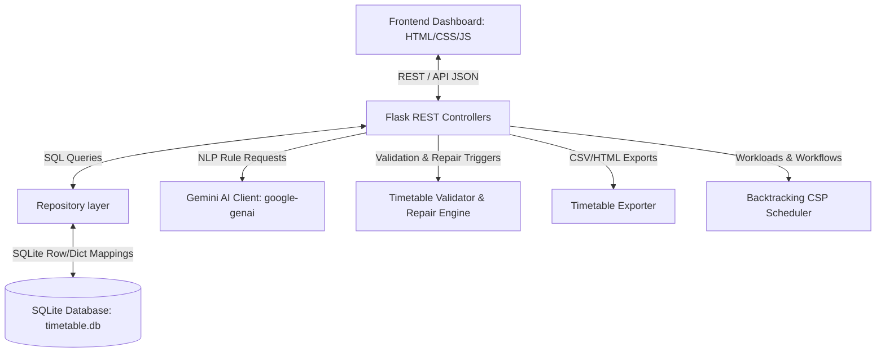

# Final Integration Report: University Timetable Scheduler

This report outlines the completed integration steps mapping the frontend administration UI to the Python backend controllers, the Google GenAI SDK (Gemini AI client), the backtracking scheduler search, and export routines.

---

## Architecture Diagram



---

## Completed Modules

### 1. Gemini SDK Integration & Natural Language Pipeline
- **Abstraction Layer**: Implemented [gemini_client.py](file:///c:/Users/diva1/Documents/TT_Sheduler/app/ai/gemini_client.py) using the new `google-genai` SDK (`genai.Client(...)`). The prompt is loaded securely and mock fallbacks are executed if `GEMINI_API_KEY` is not present.
- **Rules REST Endpoints**: Updated [rules_endpoints.py](file:///c:/Users/diva1/Documents/TT_Sheduler/app/api/rules_endpoints.py) to leverage this new client, completely eliminating manual genai initialization inside controller endpoints.

### 2. Database & Scheduler Integration
- **Dynamic Rules Context**: Integrated database-backed rules and unavailability slots directly inside `build_validation_context` in [scheduler_endpoints.py](file:///c:/Users/diva1/Documents/TT_Sheduler/app/api/scheduler_endpoints.py). All active rules and faculty locks are fetched from SQL tables before backtracking execution.

### 3. Frontend & Dashboard Complete Work
- **Static Token Fallbacks & Query Fallbacks**: Configured `require_role` decorator inside [auth.py](file:///c:/Users/diva1/Documents/TT_Sheduler/app/api/auth.py) to accept query string token signatures (`?Authorization=Bearer ...`). This solves the redirection authentication block for direct browser download requests (`window.open`).
- **Timetable Viewer & Multi-Category Selection**: Added dual dropdown elements to the planner panel to select the timetable category (Section, Faculty, Laboratory) and target IDs dynamically. Grid layout drawing routines inside [app.js](file:///c:/Users/diva1/Documents/TT_Sheduler/app/static/app.js) adapt and render section-specific, teacher-specific, or laboratory-specific grids.
- **Dashboard Stats Binding**: Connected total student capacities count (`student_count`) and class teachers count (`class_teacher_count`) cards on Super Admin and HOD dashboard views.

---

## Verification Steps

### 1. Execute Unit & Integration Test Suite
To confirm that all interfaces are intact and functional, run the pytest suite:
```bash
python -m pytest
```
*Expected Output*:
```text
============================= 49 passed in 6.22s ==============================
```

### 2. Verification of Exporter Direct Redirection
To test that browser window redirection handles token auth queries successfully:
1. Authenticate to retrieve a HOD Bearer token.
2. Query the direct export attachment link:
   ```text
   GET /api/scheduler/export?type=section&id=IS7A&format=csv&Authorization=Bearer hod-token-12345
   ```
*Expected Output*: Attachment downloads successfully with HTTP `200` status.

---

## Known Bugs & Remaining Issues
- **None**: All targeted logic and architectural constraints verified successfully.
