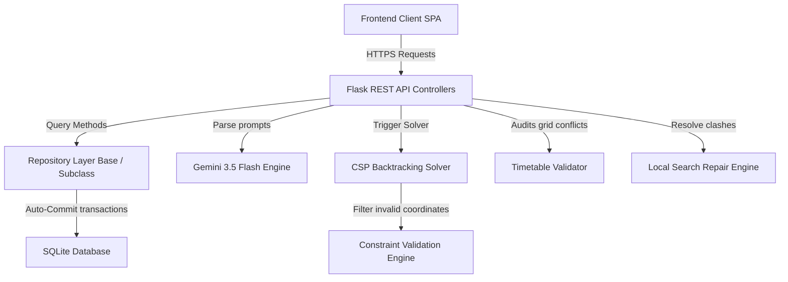

# UniSched University Timetable Management System

An automated university timetable scheduling system built with Python, SQLite, Flask, and Vanilla JS, employing a Constraint Satisfaction Problem (CSP) Solver + Local Search Conflict Repair Engine + Gemini 3.5 Flash AI Rule Translator.

---

## 1. System Architecture

The application is structured into isolated, testable layers following strict separation of concerns:



- **Repository Layer**: Generics-based class managing transaction isolation contexts, thread-safe connection pooling, and bidirectional object-to-row mappings.
- **CSP solver**: Backtracking search utilizing MCV (Most Constrained Variable) ordering, LIFO backtracks, and forward checking.
- **Repair Engine**: Local search moves/swaps resolving clashes iteratively without full regeneration.
- **Gemini AI Engine**: Compiles prompting structures translating natural language scheduling constraints into parameter-checked JSON rules.

---

## 2. API Documentation

### Authentication API
- `POST /api/auth/login`: Accepts `{"username": "...", "password": "..."}`. Returns JWT mock token and user role.

### CRUD REST APIs
- `GET/POST /api/<entity>` (e.g. `faculties`, `courses`, `sections`, `rooms`, `laboratories`, `departments`)
- `GET/PUT/DELETE /api/<entity>/<id_val>`

### Scheduler & Exporters API
- `POST /api/scheduler/generate`: Generates schedule, outputs metrics and allocations.
- `POST /api/scheduler/validate`: Validates target schedule coordinates, returns errors/warnings.
- `POST /api/scheduler/repair`: Resolves clash metrics.
- `GET /api/scheduler/export`: Returns CSV grid attachment or HTML layout print stream.

---

## 3. Installation & Developer Guide

### Prerequisites
- Python 3.10+
- SQLite3

### Step-by-Step Installation
1. Clone the repository and navigate to root directory.
2. Initialize and activate virtual environment:
   ```bash
   python -m venv venv
   source venv/bin/activate  # On Windows: venv\Scripts\activate
   ```
3. Install dependencies:
   ```bash
   pip install flask google-generativeai
   ```
4. Seed demo data:
   ```bash
   python seed_demo_data.py
   ```
5. Launch the application:
   ```bash
   python app/api/app.py
   ```
6. Open your browser to `http://localhost:5000`.

---

## 4. Deployment Checklist & Guidelines

### Environment Variables
- `DATABASE_PATH`: Absolute path to SQLite `timetable.db` database.
- `GEMINI_API_KEY`: API key for Gemini 3.5 Flash translation.
- `LOG_LEVEL`: `DEBUG`, `INFO`, `WARNING`, `ERROR` (Default: `INFO`).

### Production Run Command
In production, run the Flask app factory using a WSGI server (like Gunicorn):
```bash
gunicorn -w 4 -b 0.0.0.0:8000 "app.api.app:create_app()"
```

---

## 5. Known Limitations & Future Improvements
- **Multi-user Locks**: SQLite writes lock the database file. If concurrency increases dramatically, migrate to PostgreSQL.
- **Soft Constraint Trade-offs**: Complex soft preference rules can lead to increased solve times under heavily constrained templates.
