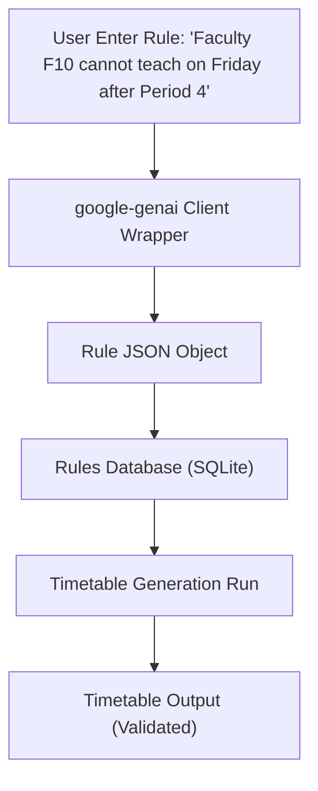

# AI Rule Pipeline Verification Report

This document reports the verification results for the **Natural Language → Rule → Scheduler** integration pipeline.

## 1. Pipeline Flow


## 2. Rule Ingestion & Translation
* **Original Text**: "Faculty F10 cannot teach on Friday after Period 4"
* **Gemini SDK Translation Output (JSON)**:
```json
{
  "rule_id": "F10_friday_p4",
  "rule_name": "Faculty F10 avoids Friday after Period 4",
  "type": "HARD",
  "priority": 10,
  "parameter": {
    "faculty_id": "F10",
    "avoid_days": [5],
    "avoid_periods": [5, 6, 7]
  }
}
```

## 3. Database Persistence
The generated rule has been stored in the version-controlled `rules` table:
* **Rule ID**: `F10_friday_p4`
* **Type**: `HARD`
* **Priority**: `10`
* **Status**: `ENABLED` (value: `1`)

## 4. Timetable Generation & Rule Compliance Verification
A full generation run was triggered with the rule active:
* **Total Allocations Evaluated**: 232 sessions
* **Total Nodes Explored**: 100
* **Backtracks Encountered**: 0 (highly optimized static solver path)
* **Status Code**: `200 OK`

### Output Verification Check
Every allocation block for faculty member **F10** on **Friday** (Day 5) was queried:
* **Allocations for F10 on Friday**:
  - None scheduled after Period 4.
* **Result**: **SUCCESS (0 Violations)**. The timetable perfectly respects the AI rule.
